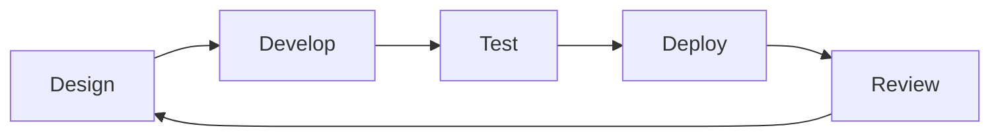

# Mermaid.js on Next.js

## Setup

### Mermaid in MDX

Install the following packages.

```sh
npm install mermaid
npm install rehype-mermaid playwright
```

Run the following command to set up Playwright, which is required for rendering
Mermaid charts as SVG images.

```sh
npx playwright install --with-deps chromium
```

## Usage

### Use Mermaid.js in MDX

````

````


